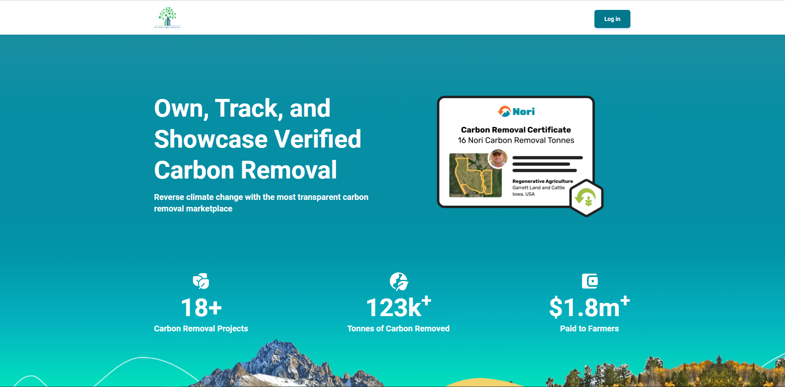

---
runme:
  id: 01HPM7D4KCDJDZVD9JFYH1NARQ
  version: v3
---

# Zero Server

## Live site

## Environment

- `Node.js v18.12.1`

## Stack

- **Framework:** `Express.js v4.18.2`
- **Database:** `MySQL v8.0.27-winx64`

## How to run the project

1. Please open terminal window in the root directory.
2. Please run command `npm run start` in it.